# Tool Flow — Wazuh MCP Server

How a request travels from the analyst's sentence to a Wazuh/3rd-party API and
back, how tools are grouped, and the end-to-end flows for the common SOC
workflows.

> Related: [PRD](./PRD.md) · [TRD](./TRD.md) · [LLM Testing Guide](./LLM_TESTING_GUIDE.md) · [Tool Table](./TOOL_TABLE.md)

---

## 1. Request lifecycle (one tool call)

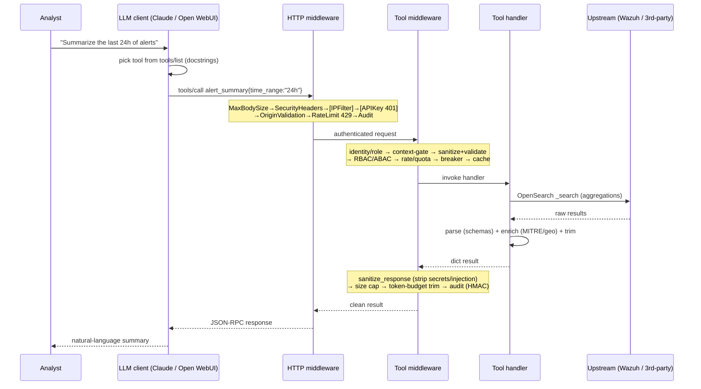

**Fast-fail points:** `413` oversized body · `401` bad/missing API key · `429`
rate limit · RBAC error (`required_role`) · context-gate error
(`required_context`) · validation error · circuit/failure-breaker open.

---

## 2. Tool registration flow (startup)

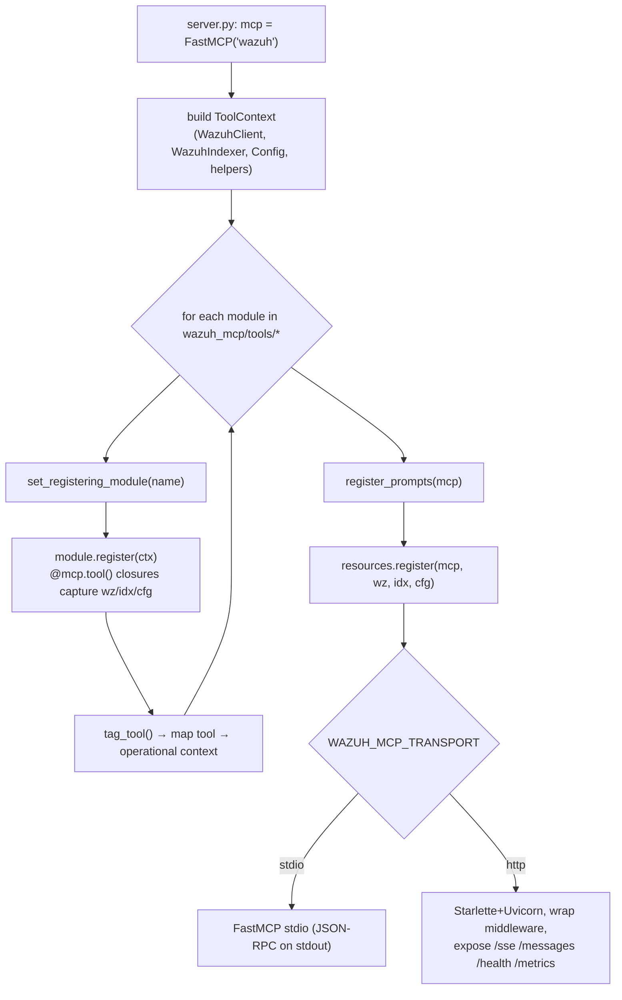

---

## 3. Tool groups → operational contexts

Modules are CORE (always available) unless gated into a context. With
`WAZUH_MCP_CONTEXT_GATING=true`, gated tools are inert until the caller runs
`enter_operational_context(<ctx>)` — keeping the model focused and reducing
mis-selection.

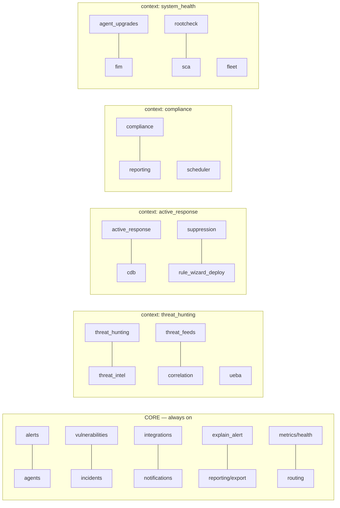

| Context | Enter with | Representative tools |
|---|---|---|
| **threat_hunting** | `enter_operational_context("threat_hunting")` | `hunt_lateral_movement`, `enrich_ip`, `bulk_enrich_iocs`, `correlate_alerts`, `detect_user_anomalies` |
| **active_response** | `enter_operational_context("active_response")` | `propose_active_response`, `add_to_cdb_list`, `bulk_suppress_rule`, `push_custom_rule` |
| **compliance** | `enter_operational_context("compliance")` | `pci_dss_compliance_summary`, `compliance_drift`, `generate_compliance_report`, `create_report_schedule` |
| **system_health** | `enter_operational_context("system_health")` | `get_agent_health_score`, `fim_summary`, `get_sca_failed_checks`, `trigger_agent_upgrade` |

`list_operational_contexts` / `exit_operational_context` manage the session set.
(Gating is **off** by default — all tools are available without entering a context.)

---

## 4. RBAC gating by tool class

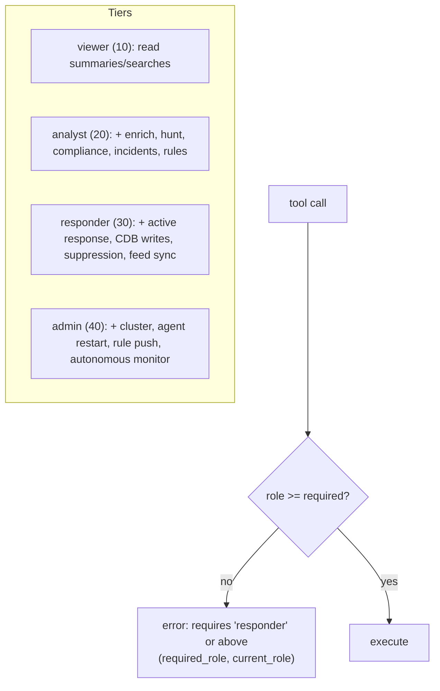

---

## 5. Common workflow flows

### 5.1 Alert triage & investigation
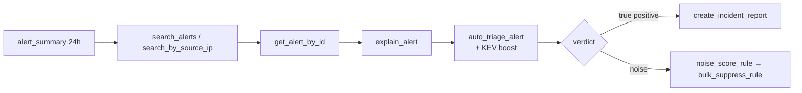

### 5.2 Threat-intel enrichment (the "is this IP/hash/domain malicious?" flow)
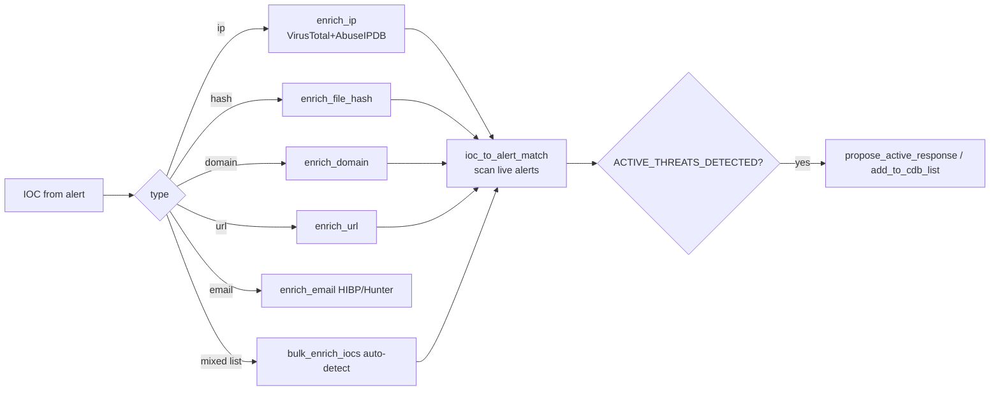

### 5.3 Incident → ticket (Jira / SOAR) flow
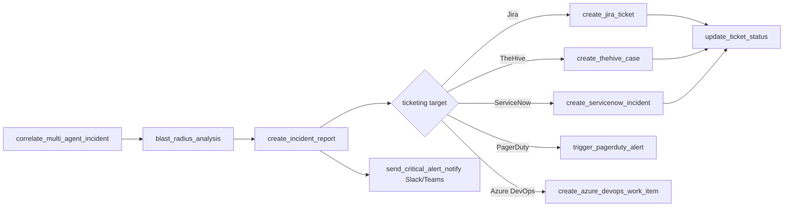

### 5.4 Active response with safety gates
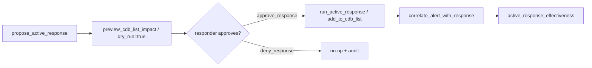

### 5.5 Compliance reporting & drift
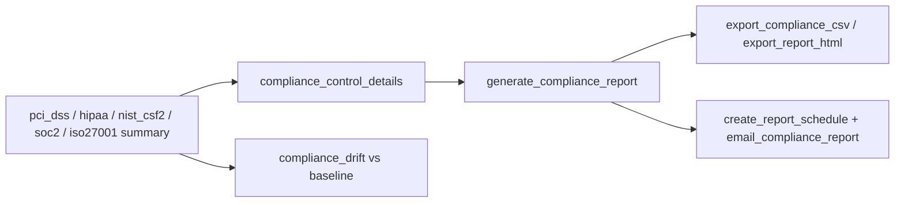

### 5.6 Detection engineering (Sigma → deployed rule)
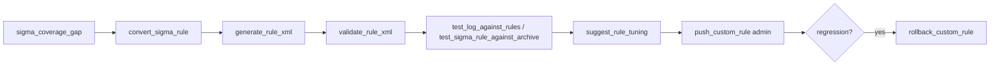

### 5.7 Autonomous SOC loop
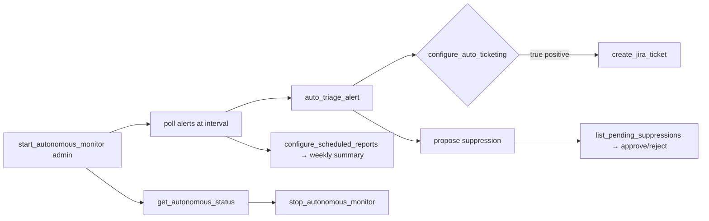

---

## 6. Prompts & resources flow

- **Prompts** (guided workflows) are invoked by the LLM client's prompt picker and
  expand into a multi-tool plan, e.g. `morning_briefing` → `alert_summary` +
  `list_unhealthy_agents` + `vulnerability_summary` + `compliance_drift`.
- **Resources** are pulled as read-only context (no side effects):
  `agents`, `mitre techniques`, `rules summary`, `health`.

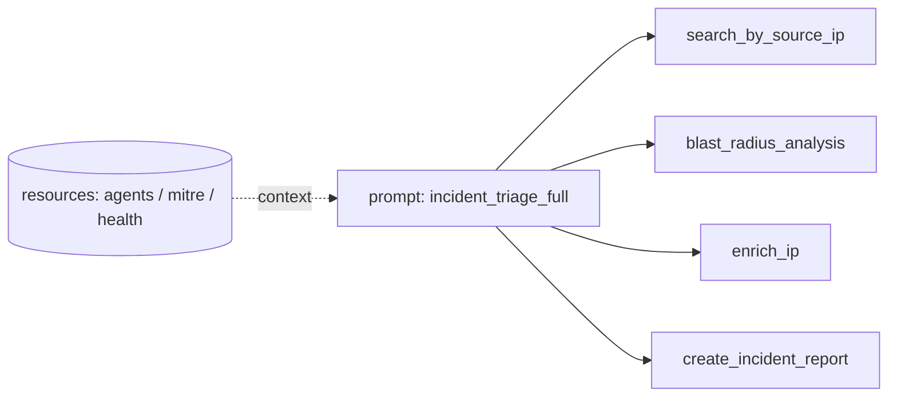

---

## 7. Where to look in code

| Concern | File |
|---|---|
| Server bootstrap, transport, middleware wiring | `wazuh_mcp/server.py` |
| Per-call pipeline | `wazuh_mcp/middleware/tool_middleware.py` |
| Operational-context grouping & gating | `wazuh_mcp/tool_contexts.py` |
| RBAC tiers / decorator | `wazuh_mcp/rbac.py` |
| Tool implementations | `wazuh_mcp/tools/<domain>.py` |
| Prompts / resources | `wazuh_mcp/prompts.py` / `wazuh_mcp/resources.py` |
| Upstream clients | `wazuh_mcp/wazuh_client.py` / `wazuh_mcp/wazuh_indexer.py` |
| Full tool inventory | `docs/TOOL_TABLE.md` (generate with `scripts/generate_tool_table.py`) |
